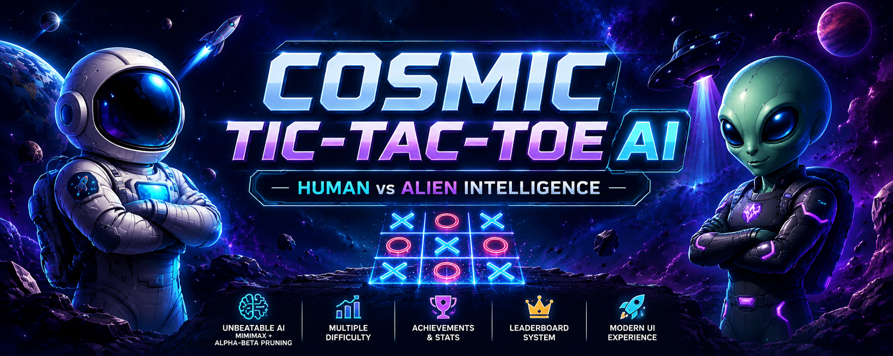
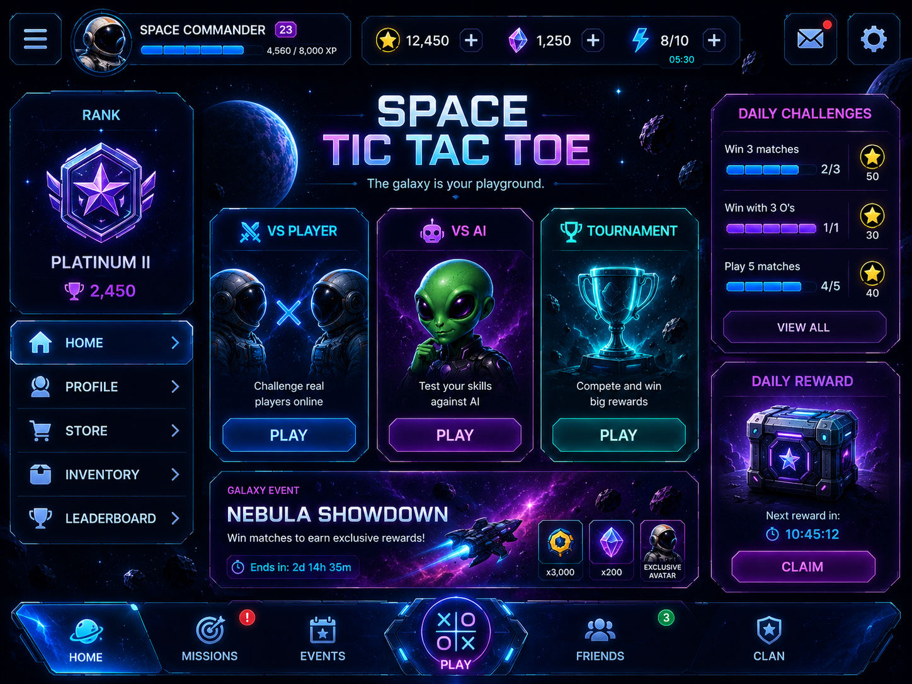
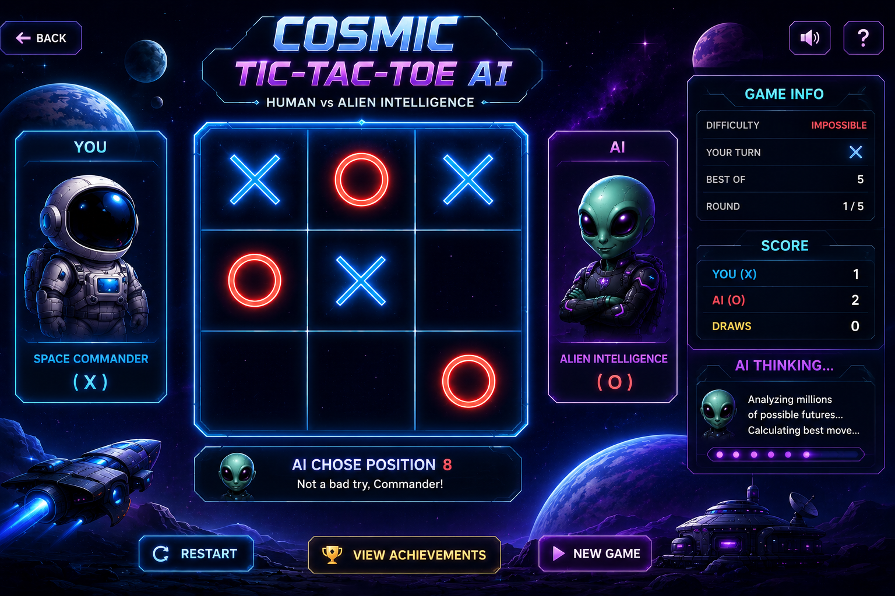
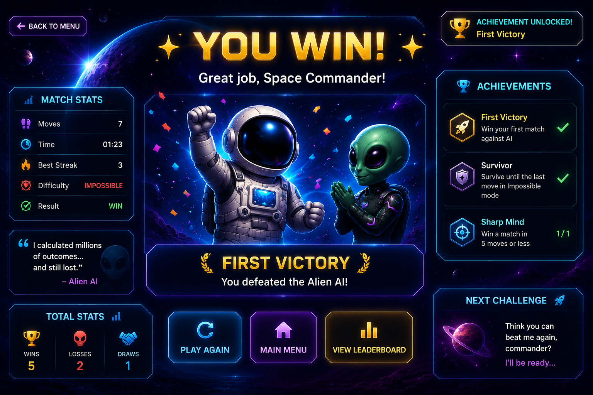
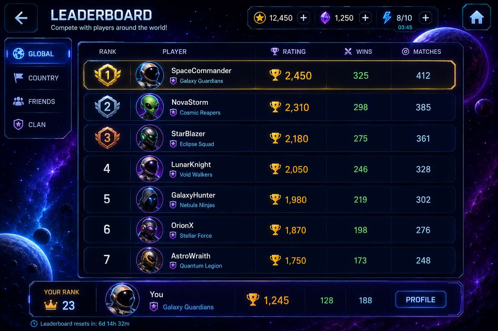

<p align="center">
  
</p>

# 🚀 Cosmic Tic-Tac-Toe AI

> A futuristic space-themed Tic-Tac-Toe game powered by an unbeatable AI using the **Minimax Algorithm** with **Alpha-Beta Pruning**.

<p align="center">
  
  
  
  
</p>

---

# 🌌 Project Overview

**Cosmic Tic-Tac-Toe AI** is an advanced implementation of the classic Tic-Tac-Toe game where a human commander battles against an intelligent Alien AI.

This project was developed as part of an AI Internship Program to demonstrate:

- Artificial Intelligence
- Game Theory
- Minimax Algorithm
- Alpha-Beta Pruning
- GUI Development with Tkinter
- Object-Oriented Programming
- Data Persistence using JSON

---

# 🎮 Features

## 🤖 Intelligent AI Opponent

- Easy Mode
- Medium Mode
- Impossible Mode (Unbeatable AI)

## 🚀 Space-Themed User Interface

- Cosmic Home Screen
- Astronaut Commander Avatar
- Alien AI Avatar
- Sci-Fi Inspired Design

## 📊 Match Analytics

Track:

- Player Moves
- AI Moves
- Difficulty Level
- Match Results

## 🏆 Result Screens

- Victory Screen
- Defeat Screen
- Draw Screen

## 🎯 AI Techniques

- Minimax Search Algorithm
- Alpha-Beta Pruning
- Optimal Move Selection

## 🔄 Navigation System

- Home Screen
- Game Screen
- Result Screen
- Restart Match
- Return Home

## 📂 Additional Modules

- Leaderboard System
- Achievement Tracking
- JSON Data Persistence

---

# 🖼️ Screenshots

## 🏠 Home Screen



---

## 🎮 Gameplay



---

## 🏆 Victory Screen



---

## 📊 Leaderboard



---

# 🏗️ Project Structure

```text
Cosmic-Tic-Tac-Toe-AI
│
├── assets
│   ├── banner.png
│   ├── astronaut_avatar.png
│   ├── alien_avatar.png
│   ├── x_icon.png
│   └── o_icon.png
│
├── data
│   ├── leaderboard.json
│   └── achievements.json
│
├── screens
│   ├── home_screen.py
│   ├── game_screen.py
│   └── result_screen.py
│
├── ai.py
├── game.py
├── leaderboard.py
├── achievements.py
├── main.py
├── requirements.txt
└── README.md
```

---

# 🧠 How the AI Works

## Minimax Algorithm

The AI evaluates all possible future game states and chooses the move that maximizes its chances of winning while minimizing the opponent's chances.

## Alpha-Beta Pruning

Alpha-Beta Pruning reduces the number of game states explored during the search process, significantly improving performance without affecting decision quality.

### Outcome

On **Impossible Mode**, the AI will:

- Never lose
- Always block winning moves
- Always choose the optimal strategy

---

# ⚙️ Installation

## Clone the Repository

```bash
git clone https://github.com/YOUR_USERNAME/cosmic-tic-tac-toe-ai.git
```

## Navigate to Project Folder

```bash
cd cosmic-tic-tac-toe-ai
```

## Install Dependencies

```bash
pip install -r requirements.txt
```

## Run the Application

```bash
python main.py
```

---

# 📦 Requirements

```txt
pillow
```

---

# 🎯 Learning Outcomes

Through this project I learned:

- Artificial Intelligence Fundamentals
- Adversarial Search Algorithms
- Minimax Strategy
- Alpha-Beta Pruning Optimization
- Python GUI Development
- Event-Driven Programming
- Software Architecture
- Object-Oriented Design
- Data Persistence with JSON

---

# 🚀 Future Enhancements

- 🔊 Sound Effects
- 🎞️ Animated AI Thinking Screen
- 👥 Multiplayer Mode
- 🌐 Online Matchmaking
- 🌙 Dark / Light Themes
- 📈 Statistics Dashboard
- 🤖 AI Difficulty Analytics
- 🏅 Expanded Achievement System

---

# 👩‍💻 Author

**Upasana Pawar**
---

# ⭐ Support

If you found this project interesting, consider giving it a **Star ⭐** on GitHub.

It helps others discover the project and supports future development.
